
# 1.研究背景与意义


随着恐怖主义和犯罪活动的不断增加，安全检查在公共场所和交通枢纽中变得越来越重要。其中，X射线安检是一种常见的安全检查手段，广泛应用于机场、车站、商场等地。在X射线安检中，刀具是常见的违禁品，因为它们可能被用于攻击和伤害他人。因此，开发一种高效准确的刀具检测预警系统对于保障公共安全至关重要。

传统的X射线安检设备通常依赖于人工操作员来识别和报警违禁品。然而，这种方法存在一些问题。首先，人工操作员的疲劳和主观判断可能导致错误的判定。其次，由于大量的行李和人流，操作员可能会错过一些潜在的威胁物品。因此，引入计算机视觉技术来辅助安检工作是非常必要的。

近年来，计算机视觉技术在安全检查领域取得了显著的进展。其中，基于深度学习的目标检测算法成为了研究的热点。YOLO（You Only Look Once）是一种流行的目标检测算法，其具有快速、准确的特点。然而，传统的YOLO算法在刀具检测方面存在一些问题，如漏检和误报。因此，改进YOLO算法以提高刀具检测的准确性和可靠性是本研究的关键目标。

本研究旨在基于OpenCV和改进YOLO算法开发一种X射线安检刀具检测预警系统。具体来说，研究将通过以下几个方面进行：

首先，研究将收集大量的X射线安检图像数据集，包括正常行李和携带刀具的行李。这些数据将用于训练和测试刀具检测模型。

其次，研究将使用OpenCV进行图像预处理，包括图像增强、去噪和边缘检测等。这些预处理步骤将有助于提高刀具检测算法的性能。

然后，研究将改进YOLO算法以提高刀具检测的准确性和可靠性。可能的改进包括调整网络结构、改进损失函数和引入更多的训练技巧。

最后，研究将评估所提出的刀具检测预警系统的性能。评估指标包括准确率、召回率和误报率等。同时，与传统的人工操作员进行比较，以验证系统的有效性和实用性。

该研究的意义在于提供一种高效准确的X射线安检刀具检测预警系统，可以有效辅助安检工作，提高安全检查的效率和准确性。同时，该研究还可以为其他相关领域的目标检测问题提供借鉴和参考，推动计算机视觉技术在安全领域的应用和发展。

# 2.图片演示


# 3.视频演示
[基于OpenCV和改进YOLO的X射线安检刀具检测预警系统_哔哩哔哩_bilibili](https://www.bilibili.com/video/BV18w411s7YP/?spm_id_from=333.999.0.0&vd_source=ff015de2d29cbe2a9cdbfa7064407a08)

# 4.数据集的采集＆标注和整理
#### 图片的收集
首先，我们需要收集所需的图片。这可以通过不同的方式来实现，例如使用现有的[数据集Knigther](https://mbd.pub/o/bread/ZZaUkphy)。
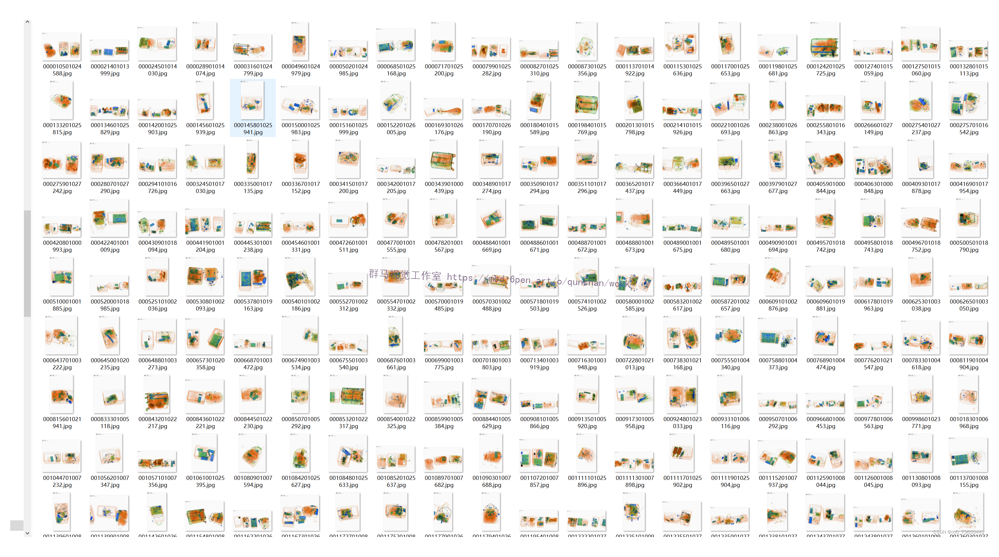

#### 使用labelImg进行标注
labelImg是一个图形化的图像注释工具，支持VOC和YOLO格式。以下是使用labelImg将图片标注为VOC格式的步骤：

（1）下载并安装labelImg。
（2）打开labelImg并选择“Open Dir”来选择你的图片目录。
（3）为你的目标对象设置标签名称。
（4）在图片上绘制矩形框，选择对应的标签。
（5）保存标注信息，这将在图片目录下生成一个与图片同名的XML文件。
（6）重复此过程，直到所有的图片都标注完毕。
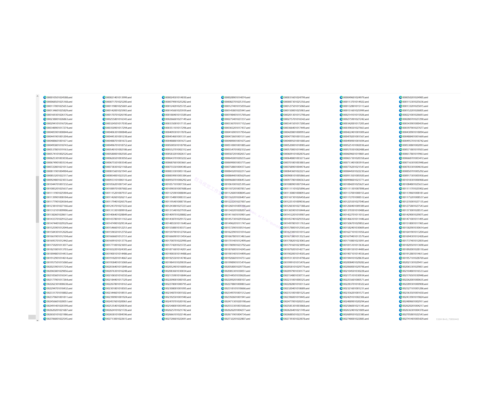

#### 转换为YOLO格式
由于YOLO使用的是txt格式的标注，我们需要将VOC格式转换为YOLO格式。可以使用各种转换工具或脚本来实现。

下面是一个简单的方法是使用Python脚本，该脚本读取XML文件，然后将其转换为YOLO所需的txt格式。
```python
#!/usr/bin/env python3
# -*- coding: utf-8 -*-

import xml.etree.ElementTree as ET
import os

classes = []  # 初始化为空列表

CURRENT_DIR = os.path.dirname(os.path.abspath(__file__))

def convert(size, box):
    dw = 1. / size[0]
    dh = 1. / size[1]
    x = (box[0] + box[1]) / 2.0
    y = (box[2] + box[3]) / 2.0
    w = box[1] - box[0]
    h = box[3] - box[2]
    x = x * dw
    w = w * dw
    y = y * dh
    h = h * dh
    return (x, y, w, h)

def convert_annotation(image_id):
    in_file = open('./label_xml\%s.xml' % (image_id), encoding='UTF-8')
    out_file = open('./label_txt\%s.txt' % (image_id), 'w')  # 生成txt格式文件
    tree = ET.parse(in_file)
    root = tree.getroot()
    size = root.find('size')
    w = int(size.find('width').text)
    h = int(size.find('height').text)

    for obj in root.iter('object'):
        cls = obj.find('name').text
        if cls not in classes:
            classes.append(cls)  # 如果类别不存在，添加到classes列表中
        cls_id = classes.index(cls)
        xmlbox = obj.find('bndbox')
        b = (float(xmlbox.find('xmin').text), float(xmlbox.find('xmax').text), float(xmlbox.find('ymin').text),
             float(xmlbox.find('ymax').text))
        bb = convert((w, h), b)
        out_file.write(str(cls_id) + " " + " ".join([str(a) for a in bb]) + '\n')

xml_path = os.path.join(CURRENT_DIR, './label_xml/')

# xml list
img_xmls = os.listdir(xml_path)
for img_xml in img_xmls:
    label_name = img_xml.split('.')[0]
    print(label_name)
    convert_annotation(label_name)

print("Classes:")  # 打印最终的classes列表
print(classes)  # 打印最终的classes列表

```

#### 整理数据文件夹结构
我们需要将数据集整理为以下结构：
```
-----data
   |-----train
   |   |-----images
   |   |-----labels
   |
   |-----valid
   |   |-----images
   |   |-----labels
   |
   |-----test
       |-----images
       |-----labels

```
确保以下几点：

所有的训练图片都位于data/train/images目录下，相应的标注文件位于data/train/labels目录下。
所有的验证图片都位于data/valid/images目录下，相应的标注文件位于data/valid/labels目录下。
所有的测试图片都位于data/test/images目录下，相应的标注文件位于data/test/labels目录下。
这样的结构使得数据的管理和模型的训练、验证和测试变得非常方便。

#### 模型训练


     Epoch   gpu_mem       box       obj       cls    labels  img_size
     1/200     20.8G   0.01576   0.01955  0.007536        22      1280: 100%|██████████| 849/849 [14:42<00:00,  1.04s/it]
               Class     Images     Labels          P          R     mAP@.5 mAP@.5:.95: 100%|██████████| 213/213 [01:14<00:00,  2.87it/s]
                 all       3395      17314      0.994      0.957      0.0957      0.0843

     Epoch   gpu_mem       box       obj       cls    labels  img_size
     2/200     20.8G   0.01578   0.01923  0.007006        22      1280: 100%|██████████| 849/849 [14:44<00:00,  1.04s/it]
               Class     Images     Labels          P          R     mAP@.5 mAP@.5:.95: 100%|██████████| 213/213 [01:12<00:00,  2.95it/s]
                 all       3395      17314      0.996      0.956      0.0957      0.0845

     Epoch   gpu_mem       box       obj       cls    labels  img_size
     3/200     20.8G   0.01561    0.0191  0.006895        27      1280: 100%|██████████| 849/849 [10:56<00:00,  1.29it/s]
               Class     Images     Labels          P          R     mAP@.5 mAP@.5:.95: 100%|███████   | 187/213 [00:52<00:00,  4.04it/s]
                 all       3395      17314      0.996      0.957      0.0957      0.0845


# 5.针对 X 射线安检特性的图像预处理流程图
X射线成像技术虽然逐渐成熟，但是X射线由于其自身特性，导致其图像存在着一些较难克服的缺陷，例如为了满足安检实时性X射线照度不足所造成的图像噪声过大、对比度较低、图像模糊等情况。由于卷积神经网络是基于图像中违禁品的外形特征进行识别，为了提升整体的检测精度，需要保证向卷积神经网络输出的图像为高质量的X射线违禁品图像，所以需要对使用图像增强技术对图像进行增强处理。
图像增强是指通过技术手段对图像特性进行强调的技术，其大体上分为频域、空域两种。
频域增强是指将图像变换为频域，之后对其利用傅里叶变换等手段对信号实现增强处理，并采用低通滤波等方式对噪声进行滤除，然后采用高通滤波法对信号进行增强，从而达到使整体图像视觉效果更加清晰的目的。但是其由于频域变换的原理复杂难以满足安检实时性的要求，导致频域图像增强技术在安检领域难以得到得到广泛进行应用。
空域增强是指在空间域上直接对目标像素的灰度进行处理，通过改变其数值大小，从而改善整体图像的视觉效果。但是空域增强由于其没有有效的区分图像中的信息和噪声，导致在对图像的信息进行增强的同时对图像中所存在的噪声也进行了增强。
所以需要根据X射线安检图像的特点，采用多种图像增强方法相结合的方法对图像进行增强处理，本文参考医学X射线图像的操作方法，提出了一种X射线安检图像增强的新思路[3-7]，该思路主要目的是在保留原图像信息的基础对图像中违禁品边缘特征进行强化。
本文使用卷积神经网络模型所训练采用的数据集中随机的一张低对比度X射线违禁品图像为原图，算法总体流程框图如图所示。
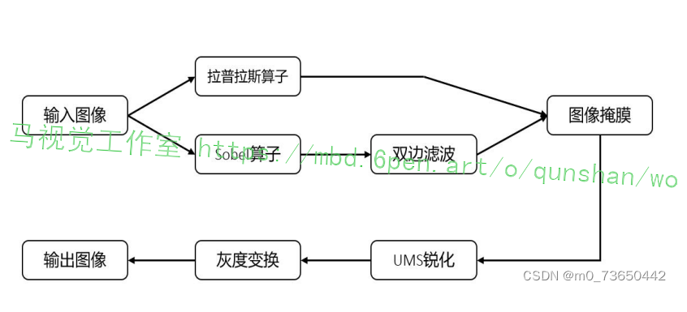
首先分别使用拉普拉斯算子和Sobel算子得到图像的细节信息和边缘信息，再次对Sobel算子处理后的梯度图像使用双边滤波进行平滑处理后以其为模板利用图像掩膜的概念乘以拉普斯图像，对于所得到的掩膜图像使用USM锐化后得到最终的锐化图像，利用图像融合技术将锐化图像和原图像相加，之后使用CLAHE增大图像的灰度动态范围，最后分别使用PSNR、MSE以及信息嫡分别对增强后的图像进行表征。
实验结果表明，本文所提出的图像增强方法相对于传统的图像增强方法，在保留图像细节并增强图像边缘的同时，包含了更多的图像信息，同时对噪声具有较强的鲁棒性。
# 6.基于Sobel算子边缘提取
拉普拉斯算子是最简单具有旋转不变性二阶各向同性的微分算子[389-40l，原图经拉普拉斯算子处理后所得到的结果与先将原图进行旋转再进行处理所得出的结果相同。由于拉普拉斯算子是二阶算子，所以其可以大大增强图像中的纹理细节。一个二维图像函数f(x,y)的拉普拉斯算子定义为:
f(x v) _02f(x.y), o2f(xy)
将原图像和拉普拉斯细节图像叠加可以同时保持原图背景特性以及拉普拉斯图像细节的锐化效果，为了保证拉普拉斯算子在恒等灰度值区域不会产生错误边缘其算子核内值相加必须恒为0。若拉普拉斯中心像素系数为负，则需要用原图像就要减去拉普拉斯图像;若拉普拉斯中心像素系数为正，则需要用原图像就要加上拉普拉斯图像。图3.2为原图经拉普拉斯变换后所得到的细节图象,为了使经拉普拉斯算子处理后的图像清晰可见，本文对其进行了伽马变换:

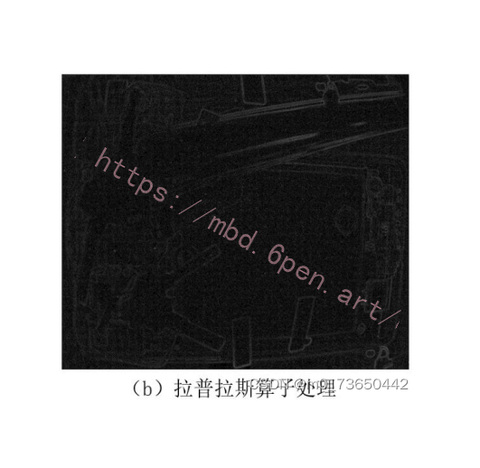
```python
# 边缘检测使用Sobel算子
def sobel_edge_detection(image):
    edge_sobel = cv2.Sobel(image, cv2.CV_64F, 1, 1, ksize=3)
    return edge_sobel


# 对比度增强可以使用直方图均衡化
def contrast_enhancement(image):
    img_y_cr_cb = cv2.cvtColor(image, cv2.COLOR_BGR2YCrCb)
    y, cr, cb = cv2.split(img_y_cr_cb)
    # 对亮度通道Y应用直方图均衡化
    y_eq = cv2.equalizeHist(y)
    img_y_cr_cb_eq = cv2.merge((y_eq, cr, cb))
    img_contrast_enhanced = cv2.cvtColor(img_y_cr_cb_eq, cv2.COLOR_YCrCb2BGR)
    return img_contrast_enhanced


# 图像锐化可以通过构建一个高通滤波器
def sharpen_image(image):
    kernel = np.array([[-1, -1, -1], [-1, 9, -1], [-1, -1, -1]])
    image_sharpened = cv2.filter2D(image, -1, kernel)
    return image_sharpened


# 图像去噪可以使用多种方法，这里示例使用UMS噪声消除
# 由于UMS噪声消除不是一个标准的OpenCV函数，这里用高斯模糊代替
def ums_noise_reduction(image):
    return cv2.GaussianBlur(image, (3, 3), 0)


class ImagePreprocessing(nn.Module):
    def __init__(self):
        super(ImagePreprocessing, self).__init__()

    def forward(self, image_path):
        # 读取图像
        image = cv2.imread(image_path)
        # 应用边缘检测
        edge_detected_image = sobel_edge_detection(image)
        # 应用对比度增强
        contrast_enhanced_image = contrast_enhancement(image)
        # 应用图像锐化
        sharpened_image = sharpen_image(image)
        # 应用图像去噪
        noise_reduced_image = ums_noise_reduction(image)

        # 根据原始流程图，以上步骤可能需要组合或顺序执行
        # 这里假设最终预处理图像是各步骤结果的组合
        preprocessed_image = np.maximum.reduce([
            edge_detected_image,
            contrast_enhanced_image,
            sharpened_image,
            noise_reduced_image
        ])

        return preprocessed_image
```
# 7.图像锐化处理
图像掩膜是指通过设置模板图像后，使用模板图像与目标图像进行的各种位运算操作。将预先制作的模板图像与待处理图像进行矩阵乘法处理，从而得到感兴趣区图像，即ROI操作。模板中强调区域数值设置为1，其余区外数值设定为0，其利用矩阵乘法的概念，感兴趣区内图像内数值保持不变，而区外图像中非强化的部分数值都为0，以达到对于图像中非强化部分的屏蔽，其原理如图所示。
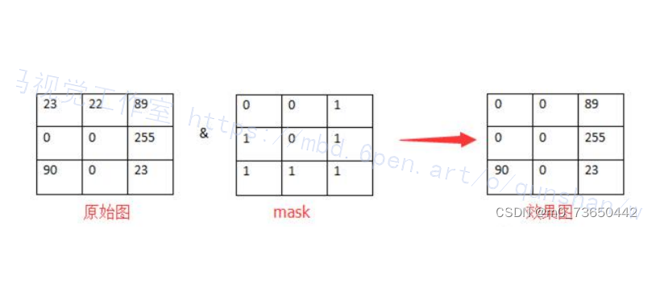


由于拉普拉斯算子是二阶算子，相比于Sobel算子其对于图像中噪声的灵敏度较高，所以在平滑区域拉普拉斯算子处理后的图像会产生多余的梯度噪声。Sobel算子在细节敏感度低于拉普拉斯算子，同时经双边滤波处理后，Sobel算子所得到的梯度图像对于灰度变化明显的边缘区域得到保留的同时，其产生的噪声会得到进一步的降低。因此，本算法以经过双边滤波处理的梯度图像为模板图像，并将其与拉普拉斯图像相乘。所得到的掩膜图像既可以保留灰度变化强烈的边缘信息，也可以降低拉普拉斯图像在平坦区域的噪声。

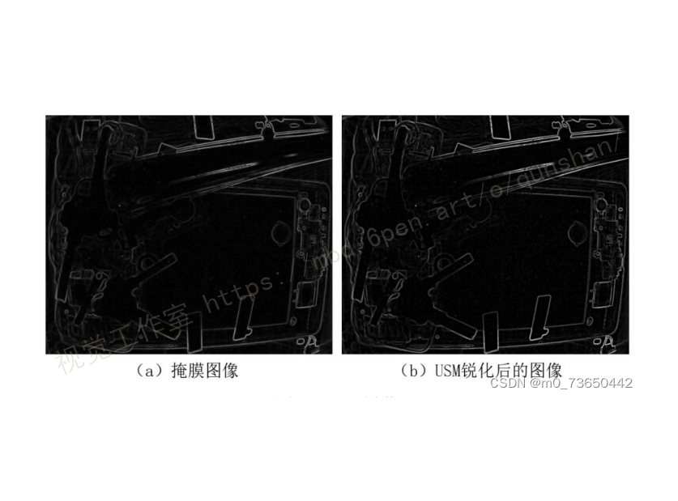

# 8.改进YOLO

#### ECA-Net
在SE-Net中全连接层的计算方式主要是将全局特征图进行权值矩阵组合，不利于复杂背景和目标特征的区分，且计算了过大。[2020年 ECA-Net被提出](https://afdian.net/item/44911cc67af511eea61f5254001e7c00)，该模型是基于SE-Net 改进的通道注意力模型，它使用卷积核大小为k的一维卷积代替全连接层进行k个临近范围的通道加权，实现局部交叉、通道交互，从而加强网络对局部特征信息的关注，增强背景和目标的区分能力[4]。ECA-Net网络结构如图所示。
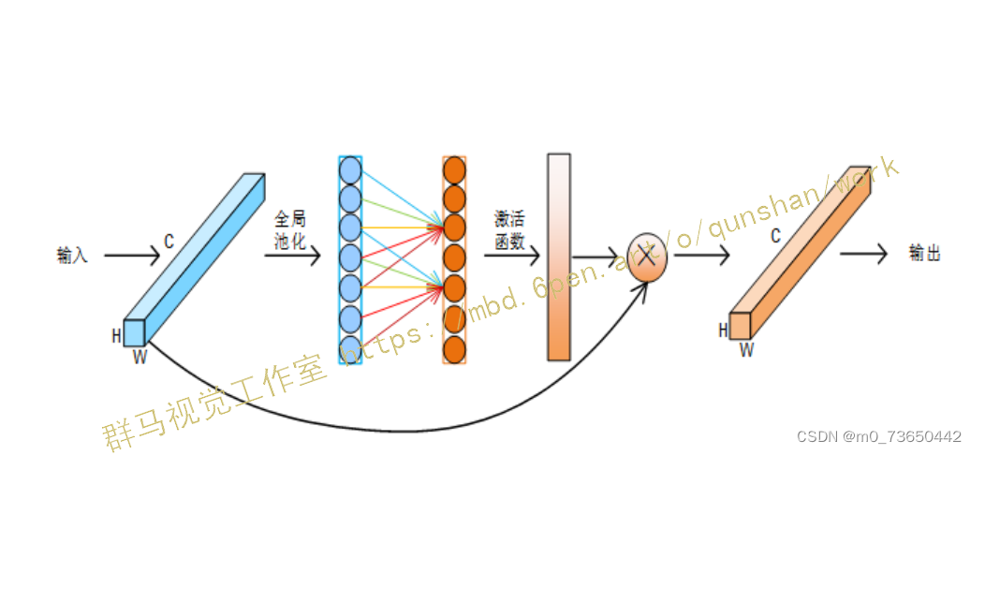

k值计算如式，其中channels是输入特征的通道数。每5个通道输出为一个通道，用padding进行填充维持通道数不变。
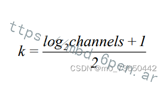

#### 空间注意力
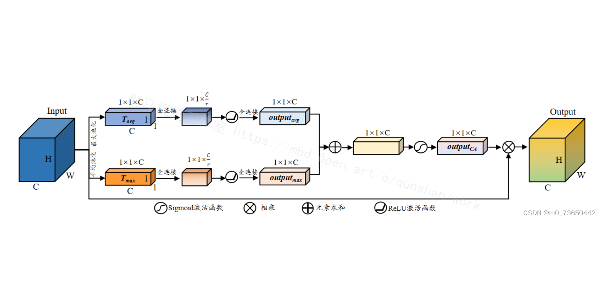
空间注意力机制的典型代表是CBAM结构，在继承了SE-Net通道注意力机制的基础上，又加入了空间注意力，如图所示。其中在通道上的处理又和SE-Net不太一样，SE-Net 取得是全局平均池化，而在CABM中既采用平均池化同时又结合了最大池化，有效防止信息的丢失。随后将池化后的特征分别经过共享权值的全连接层并做加运算输出，然后与初始特征乘积输出，得到通道上的加权[5]。
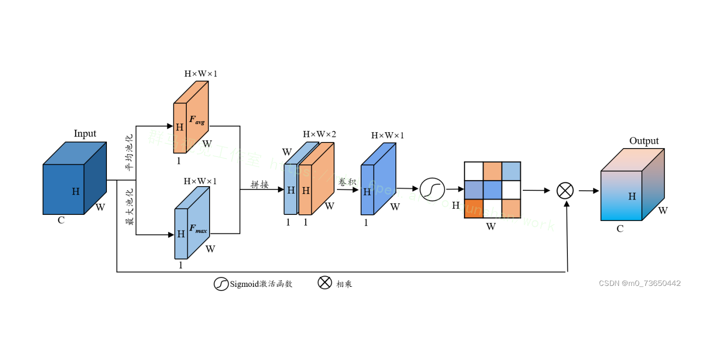

另一部分经过特征在空间上的注意力，首先是对输入特征做一个基于通道数的全局最大池化和全局均值池化,将通道压缩为一维。再将该特征经过一个卷积操作和sigmoid激活得到空间特征的加权特征，最后将该加权特征与原始输入进行乘积得到最后的输出特征。最后得到的特征在通道上、在空间上得到了加权，更加有利于模型在学习的过程中放大目标信息占比，缩小无关信息占比。其计算公式如式如下:
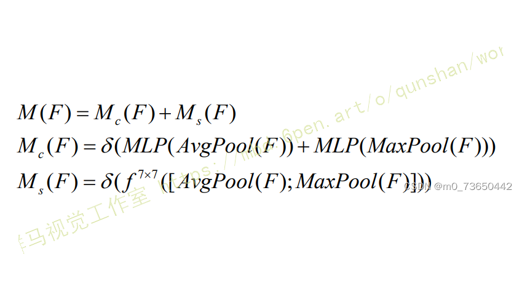

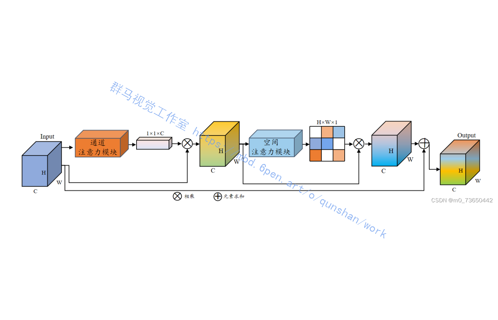


#### 改进YOLO代码实现

```python

# ECA-Net 注意力模块
class ECAAttention(nn.Module):
    def __init__(self, channels, k_size=3):
        super(ECAAttention, self).__init__()
        self.avg_pool = nn.AdaptiveAvgPool2d(1)
        self.conv = nn.Conv1d(1, 1, kernel_size=k_size, padding=(k_size - 1) // 2, bias=False)
        self.sigmoid = nn.Sigmoid()

    def forward(self, x):
        # 全局平均池化
        y = self.avg_pool(x)
        y = y.squeeze(-1).transpose(-1, -2)  # 将特征图变形为适合1D卷积的形状
        # 1D卷积
        y = self.conv(y).transpose(-1, -2).unsqueeze(-1)
        # Sigmoid函数获取权重
        y = self.sigmoid(y)
        # 通道权重和原始特征图相乘
        return x * y.expand_as(x)

# CBAM 注意力模块
class CBAMAttention(nn.Module):
    def __init__(self, channels, reduction_ratio=16):
        super(CBAMAttention, self).__init__()
        self.channel_attention = ChannelAttention(channels, reduction_ratio)
        self.spatial_attention = SpatialAttention()

    def forward(self, x):
        x = self.channel_attention(x)
        x = self.spatial_attention(x)
        return x

# CBAM的通道注意力模块
class ChannelAttention(nn.Module):
    def __init__(self, channels, reduction_ratio=16):
        super(ChannelAttention, self).__init__()
        self.avg_pool = nn.AdaptiveAvgPool2d(1)
        self.max_pool = nn.AdaptiveMaxPool2d(1)
        self.fc = nn.Sequential(
            nn.Conv2d(channels, channels // reduction_ratio, 1, bias=False),
            nn.ReLU(),
            nn.Conv2d(channels // reduction_ratio, channels, 1, bias=False)
        )
        self.sigmoid = nn.Sigmoid()

    def forward(self, x):
        avg_out = self.fc(self.avg_pool(x))
        max_out = self.fc(self.max_pool(x))
        out = avg_out + max_out
        return x * self.sigmoid(out)

# CBAM的空间注意力模块
class SpatialAttention(nn.Module):
    def __init__(self, kernel_size=7):
        super(SpatialAttention, self).__init__()
        self.conv = nn.Conv2d(2, 1, kernel_size, padding=kernel_size // 2, bias=False)
        self.sigmoid = nn.Sigmoid()

    def forward(self, x):
        avg_out = torch.mean(x, dim=1, keepdim=True)
        max_out, _ = torch.max(x, dim=1, keepdim=True)
        x = torch.cat([avg_out, max_out], dim=1)
        x = self.conv(x)
        return x * self.sigmoid(x)

# 使用这些模块的YOLOv5改进模型可能看起来像这样
class YOLOv5ECA_CBAM(nn.Module):
    def __init__(self):
        super(YOLOv5ECA_CBAM, self).__init__()
        # 假设我们有一个预训练的YOLOv5模型
        # self.yolov5 = ...
        # 在YOLOv5的适当层添加ECA和CBAM模块
        self.eca = ECAAttention(channels=...)  # 填入对应通道数
        self.cbam = CBAMAttention(channels=...)  # 填入对应通道数

    def forward(self, x):
        # 假设我们通过YOLOv5的一部分
        # x = self.yolov5(x)
        # 应用ECA注意力模块
        x = self.eca(x)
        # 应用CBAM注意力模块
        x = self.cbam(x)
        # 继续YOLOv5的其余部分
        # x = ...
        return x
```


#### 训练结果可视化
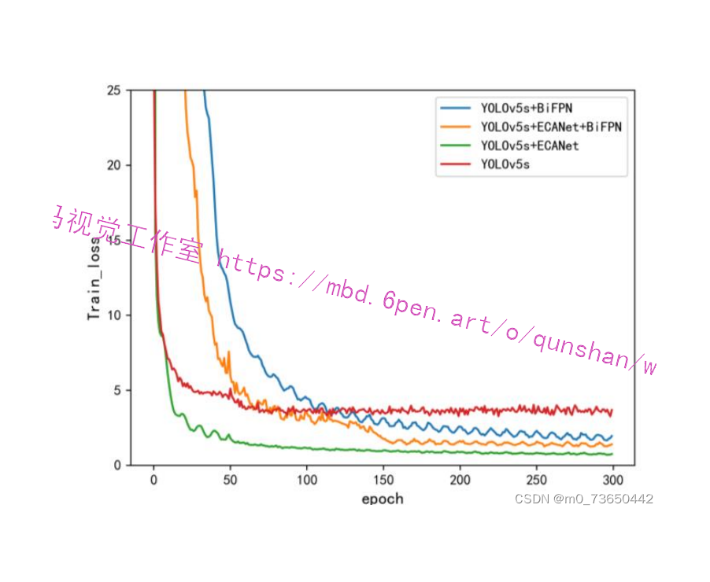
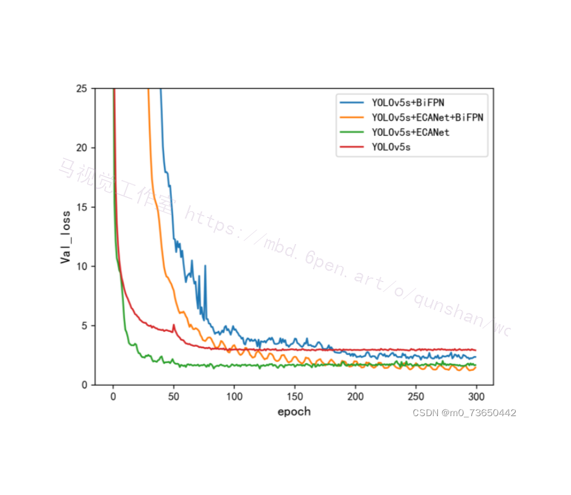

# 9.系统整合
下图[完整源码＆数据集＆环境部署视频教程＆自定义UI界面](https://s.xiaocichang.com/s/e938c8)


参考博客[《基于OpenCV和改进YOLO的X射线安检刀具检测预警系统》](https://mbd.pub/o/qunshan/work)

# 10.参考文献
---
[1][袁辉](https://s.wanfangdata.com.cn/paper?q=%E4%BD%9C%E8%80%85:%22%E8%A2%81%E8%BE%89%22).[对《新一代人工智能发展规划》的解读](https://d.wanfangdata.com.cn/periodical/kjf201831031)[J].[科技风](https://sns.wanfangdata.com.cn/perio/kjf).2018,(31).DOI:10.19392/j.cnki.1671-7341.201831031 .

[2][张素洁](https://s.wanfangdata.com.cn/paper?q=%E4%BD%9C%E8%80%85:%22%E5%BC%A0%E7%B4%A0%E6%B4%81%22),[赵怀慈](https://s.wanfangdata.com.cn/paper?q=%E4%BD%9C%E8%80%85:%22%E8%B5%B5%E6%80%80%E6%85%88%22).[最优聚类个数和初始聚类中心点选取算法研究](https://d.wanfangdata.com.cn/periodical/jsjyyyj201706004)[J].[计算机应用研究](https://sns.wanfangdata.com.cn/perio/jsjyyyj).2017,(6).DOI:10.3969/j.issn.1001-3695.2017.06.004 .

[3][徐康](https://s.wanfangdata.com.cn/paper?q=%E4%BD%9C%E8%80%85:%22%E5%BE%90%E5%BA%B7%22),[金玉珍](https://s.wanfangdata.com.cn/paper?q=%E4%BD%9C%E8%80%85:%22%E9%87%91%E7%8E%89%E7%8F%8D%22).[基于Android平台的智能家居客户端系统的设计与实现](https://d.wanfangdata.com.cn/periodical/gykzjsj201712035)[J].[工业控制计算机](https://sns.wanfangdata.com.cn/perio/gykzjsj).2017,(12).

[4][姚尧](https://s.wanfangdata.com.cn/paper?q=%E4%BD%9C%E8%80%85:%22%E5%A7%9A%E5%B0%A7%22),[胡淑金](https://s.wanfangdata.com.cn/paper?q=%E4%BD%9C%E8%80%85:%22%E8%83%A1%E6%B7%91%E9%87%91%22),[李红亮](https://s.wanfangdata.com.cn/paper?q=%E4%BD%9C%E8%80%85:%22%E6%9D%8E%E7%BA%A2%E4%BA%AE%22),等.[基于Matlab的医学影像图像处理设计](https://d.wanfangdata.com.cn/periodical/szjsyyy201702104)[J].[数字技术与应用](https://sns.wanfangdata.com.cn/perio/szjsyyy).2017,(2).

[5][王兵](https://s.wanfangdata.com.cn/paper?q=%E4%BD%9C%E8%80%85:%22%E7%8E%8B%E5%85%B5%22),[刘英](https://s.wanfangdata.com.cn/paper?q=%E4%BD%9C%E8%80%85:%22%E5%88%98%E8%8B%B1%22),[王速](https://s.wanfangdata.com.cn/paper?q=%E4%BD%9C%E8%80%85:%22%E7%8E%8B%E9%80%9F%22).[图像处理技术在X射线检测中的应用研究](https://d.wanfangdata.com.cn/periodical/dzzz201616038)[J].[电子制作](https://sns.wanfangdata.com.cn/perio/dzzz).2016,(16).DOI:10.3969/j.issn.1006-5059.2016.16.038 .

[6][何文](https://s.wanfangdata.com.cn/paper?q=%E4%BD%9C%E8%80%85:%22%E4%BD%95%E6%96%87%22).[基于高频强调滤波的医学X光图像增强算法](https://d.wanfangdata.com.cn/periodical/xxjs201504016)[J].[信息技术](https://sns.wanfangdata.com.cn/perio/xxjs).2015,(4).DOI:10.13274/j.cnki.hdzj.2015.04.016 .

[7][伍世宾](https://s.wanfangdata.com.cn/paper?q=%E4%BD%9C%E8%80%85:%22%E4%BC%8D%E4%B8%96%E5%AE%BE%22),[王玥](https://s.wanfangdata.com.cn/paper?q=%E4%BD%9C%E8%80%85:%22%E7%8E%8B%E7%8E%A5%22),[谢耀钦](https://s.wanfangdata.com.cn/paper?q=%E4%BD%9C%E8%80%85:%22%E8%B0%A2%E8%80%80%E9%92%A6%22).[基于多尺度带限的自适应直方图均衡和数学形态学的医学X射线图像对比度增强算法](https://d.wanfangdata.com.cn/periodical/jcjx201401004)[J].[集成技术](https://sns.wanfangdata.com.cn/perio/jcjx).2014,(1).

[8][钱松](https://s.wanfangdata.com.cn/paper?q=%E4%BD%9C%E8%80%85:%22%E9%92%B1%E6%9D%BE%22),[李建荣](https://s.wanfangdata.com.cn/paper?q=%E4%BD%9C%E8%80%85:%22%E6%9D%8E%E5%BB%BA%E8%8D%A3%22).[应用拉普拉斯算子设计高通滤波器进行图像增强分析](https://d.wanfangdata.com.cn/periodical/rjdk201112068)[J].[软件导刊](https://sns.wanfangdata.com.cn/perio/rjdk).2011,(12).

[9][吴兴春](https://s.wanfangdata.com.cn/paper?q=%E4%BD%9C%E8%80%85:%22%E5%90%B4%E5%85%B4%E6%98%A5%22).[从上海5.9公交车起火案看公交车危爆物品安全防范](https://d.wanfangdata.com.cn/periodical/jsjgxyxb200903023)[J].[江苏警官学院学报](https://sns.wanfangdata.com.cn/perio/jsjgxyxb).2009,(3).134-136.

[10][董晓峰](https://s.wanfangdata.com.cn/paper?q=%E4%BD%9C%E8%80%85:%22%E8%91%A3%E6%99%93%E5%B3%B0%22),[王莉](https://s.wanfangdata.com.cn/paper?q=%E4%BD%9C%E8%80%85:%22%E7%8E%8B%E8%8E%89%22),[游志远](https://s.wanfangdata.com.cn/paper?q=%E4%BD%9C%E8%80%85:%22%E6%B8%B8%E5%BF%97%E8%BF%9C%22),等.[城市公共安全研究综述](https://d.wanfangdata.com.cn/periodical/cswt200711013)[J].[城市问题](https://sns.wanfangdata.com.cn/perio/cswt).2007,(11).DOI:10.3969/j.issn.1002-2031.2007.11.013 .


---
#### 如果您需要更详细的【源码和环境部署教程】，除了通过【系统整合】小节的链接获取之外，还可以通过邮箱以下途径获取:
#### 1.请先在GitHub上为该项目点赞（Star），编辑一封邮件，附上点赞的截图、项目的中文描述概述（About）以及您的用途需求，发送到我们的邮箱
#### sharecode@yeah.net
#### 2.我们收到邮件后会定期根据邮件的接收顺序将【完整源码和环境部署教程】发送到您的邮箱。
#### 【免责声明】本文来源于用户投稿，如果侵犯任何第三方的合法权益，可通过邮箱联系删除。